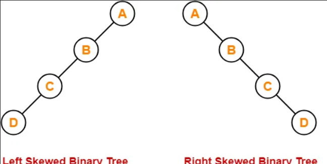
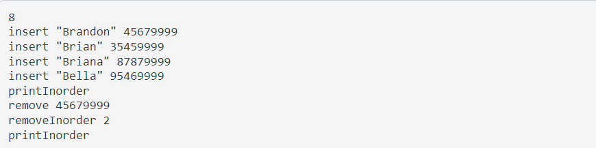
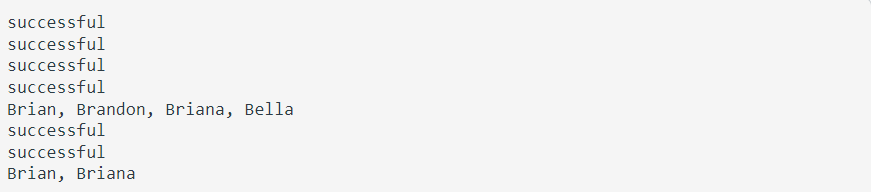

# AVLTree
A text based project that allows user to type in various commands to add/delete data in an AVL tree structure

# What's an AVL tree?
- A special type of binary search tree that balances itself after every insertion/deletion
- A solution for the common pitfall of skewed binary tree (basically a linked list)
- Why use BST if has the same worst case O(n) as a linked list?

# How to use:
1. Run the main.cpp file
2. Enter the number of commands for the for loop
3. List of commands:
- insert NAME ID
- remove ID
- search ID
- search NAME
- printInorder
- printPreorder 
- printPostorder
- printLevelCount
- removeInorder N
4. Name is a string in "" and ID and N integers. The program will reject invalid values
5. Run until the you reach number of commands
6. Sample input/output

